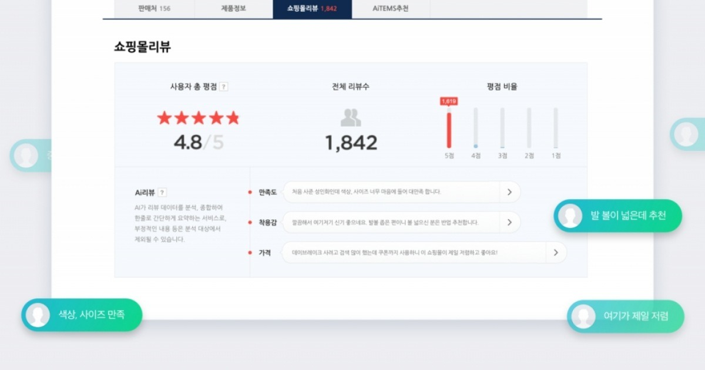

# Review Tagging with Topic Modeling
### 2023-2 COSE362 기계학습 Term Project
with [mung3477](https://github.com/mung3477), [JinSY515](https://github.com/JinSY515), [dhdbsrlw](https://github.com/dhdbsrlw)

# Problem Identification

오늘날 대부분의 리뷰들은 단순히 긴 줄글의 형태로 보여지기에,  끝까지 읽지 않는 이상 핵심이 되는 정보 혹은 사용자가 원하는 정보를 정확하게 파악하기 힘든 경우가 많습니다. 본  프로젝트에서는 이러한 문제를 해결하기 위해 리뷰  데이터들로부터 1) **텍스트  리뷰를  대표하는 토픽(ex: 가격)**를  생성하고 , 2) 생성한 토픽을 구성하는 키워드를 바탕으로 **각  리뷰들을 태깅(ex: 이 제품은 가격이 너무 비싸요 - [가격])**해보는 작업을 진행하였습니다.  이를  통해,  리뷰를  읽는  사용자가  효율적으로  자신의  구매  조건에  맞는  리뷰들을 선별해  읽을  수  있도록  하는  것이  목표입니다.

# Methodology

## 1. Naive LDA (baseline)
LDA(Latent Dirichlet Allocation) 모델을 전체 리뷰 데이터를 대상으로 수행한 뒤, Term Saliency metric을 기준으로 상위 n개의 토큰을 추출하여 키워드로 선정하였습니다.

## 2. LDA with clustering
문서를 sentenceBERT 기반 모델로 임베딩한 뒤, UMAP으로 차원축소하고 HDBSCAN을 사용하여 클러스터링했습니다. 이후 개별 클러스터를 대상으로 LDA를 수행하여 클러스터별로 토픽 키워드를 추출하였습니다.

## 3. BERTopic
클러스터링 및 c-TF-IDF metric을 기반으로 한 토픽 모델링 방법론인 [BERTopic](https://arxiv.org/abs/2203.05794)을 사용하여 토픽 모델링을 수행하였습니다.

# Dataset
본 프로젝트에서는 [Amazon Review Data (2014)](https://cseweb.ucsd.edu/~jmcauley/datasets/amazon/links.html) 중 Beauty  카테고리의  상품 
리뷰  데이터 30000개를 대상으로 토픽 모델링을 수행하였습니다.

## Preprocessing
해당 데이터셋을 다루기 위해서 다음과 같은 전처리 과정을 거쳤습니다.
- nltk 라이브러리의 TreebankWordTokenizer를 사용해 문장으로 이루어진 리뷰를 토크나이징하였습니다.
- 토픽 모델링을 위해서는 표제어를 추출해야 했기 때문에 각 토큰들에 대해 Lemmatization을 수행하였습니다. 
- 마지막으로, 데이터 처리에 방해가 될 수 있는 여러 불용어들을 제거하였습니다.

# Results
| Topic Modeling Method | coherence score |
|:---:|:---:|
| LDA w/o clustering (baseline) | 0.4598 |
| LDA w/ clustering | 0.4580 |
| **BERTopic** | **0.5495** |

|Review|Topic keyword  (BERTopic)|Topic keyword  (LDA w/ clustering)|
|:---|:---|:---|
|I've tried many facial cleansers which I was very disappointed in. This washed my makeup off and didn't cause breakouts or dry skin. This cleanser seems to help my acne and it smells wonderful. You only need a small amount of product and rub it on your face, it works even better if left on longer than 15 seconds. | ['skin', 'product'] | ['smell', 'skin', 'wash']|
|Obagi is a permanent part of my daily routine. This is an important part to keeping my skin glowing and smooth.|[‘skin’]|[‘skin’]|
|OhLaLa!Oddly enough, for a person whose color loves are 'ick' greens and orange, I have become particularly fond of pink nail polishes - mostly vibrant pinks.OPI Charged Up Cherry is a luscious, vibrant, roaring, pink. I have worn it by itself which is an &#34;oh! so perfect&#34; look, and I have also used it as an accent color and in polka dots! It's a versatile color that has an excellent 2 coat formula!A new favorite!| ['nail', 'polish', 'coat', 'color', 'use'] | ['color', 'nail', 'coat'] |
| I've tried several withe color from different brands and konad white is exactly what i was looking for, love it... best white nail polish to do stamping. | ['nail', 'polish', 'color'] | ['color', 'nail'] |
|When we haven't had soft water, this shampoo and conditioner combo have worked really well to make our hair not feel like it's a waxy, greasy mess right after washing it. It's not a miracle product, but it makes a huge difference without stripping your hair too much like some clarifying shampoos too (they can make your hair feel like straw).| ['hair', 'product', 'shampoo', 'like'] | ['hair']|
|OK the shampoo surprised me with how well it worked and then the conditioner surprised me too. Happily it worked great and made my hair very smooth. Glad I found these two products for my straight hair. | ['hair', 'product', 'shampoo'] | ['hair'] |

